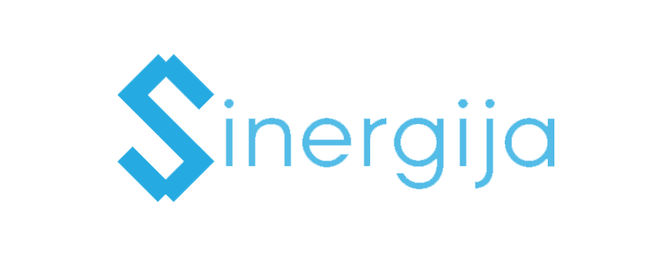

## Opis
Sinergija je veb aplikacija čija je namena ubrzanje i poboljšanje praćenja rada u [Studentskoj organizaciji Matematičkog fakulteta OMIKRON](http://omikron.org.rs) (u daljem tekstu: OMIKRON). Omogućava članovima OMIKRON-a da na jednostavan način upravljaju svojim obavezama, kao i da ih pregledaju, čime se čitava komunikacija među članovima svodi na jedno mesto.

## Ciljevi
1. Ubrzanje i poboljšanje rada u OMIKRON-u.
2. Upravljanje obavezama iz centralizovanog sistema.
3. Svođenje komunikacije među članovima na jednu platformu.

## Korišćenje
Sinergija je platforma u razvitku. Trenutno su razvijene naredne mogućnosti:
- Za sve korisnike:
  - Pristupanje sistemu
  - Izmena podataka o članu
  - Izmena profilne slike
  - Sistem privatnih poruka
  - Sistem sobe za ćaskanje
  - Pregledanje obaveza i zaduženja kontaktiranja prijatelja 
  - Podnos izveštaja kontaktiranja prijatelja 
- Za članove upravnog odbora:
  - Kreiranje novih i brisanje postojećih članova
  - Kreiranje novih obaveza
  - Kreiranje novih projekata
  - Dodavanje prijatelja organizacije i izmena njihovih podataka 
  - Delegiranje zaduženja kontaktiranja prijatelja
- Za koordinatore projekata:
  - Kreiranje novih obaveza na projektu 
  - Delegiranje zaduženja kontaktiranja prijatelja na projektu

## Razvijaoci
Sinergija je projekat koji se razvija od strane narednih programera:
- Ajzenhamer Nikola: [theikeofficial](https://github.com/theikeofficial)
- Bukurov Anja: [djinx](https://github.com/djinx)
- Stanković Vojislav: [buregdzija](https://github.com/buregdzija)